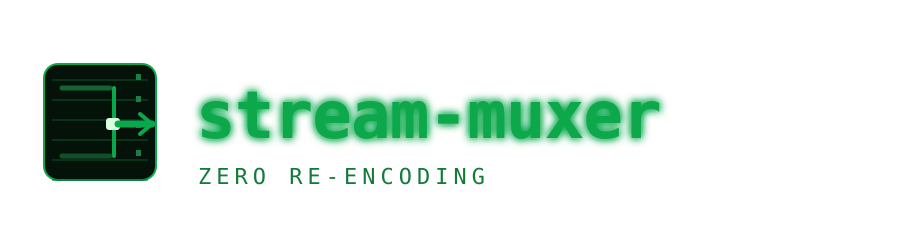

<p align="center"><b>Vibe-coded end to end, as a test bed for DeepSeek V4 Flash.</b></p>

<p align="center">
  
</p>

<h1 align="center">stream-muxer</h1>

<p align="center">
  A live RTMP <b>stream multiplexer</b>. Take several incoming streams, pick the highest-priority one that is actually delivering frames, and switch between them <b>without re-encoding</b> — fail over when one goes dark, seamless keyframe-gated cutovers, and kill the output when nothing is live.
</p>

<p align="center">
  
  
  
  
</p>

---

## What is it?

`stream-muxer` merges several live inputs into **one** output and automatically keeps the best one on air:

- Sources are **OBS boxes** pushing RTMP to a hosted ingest.
- Each source has a **priority**. The highest-priority source that is producing a real picture is on air.
- When it goes down, you **fall back** to the next one. When a higher-priority source returns, it **preempts** (after a short hold so a flapping source doesn't thrash the switch).
- The cutover happens **at a keyframe with zero re-encoding** — the muxer just remaps packets between sources and hands the still-encoded stream to your broadcast destination (CDN/RTMP).

If **no** source is up, the output is **killed** (and resumes on the next source that comes online).

## How it works

```
 OBS box A ──RTMP──┐
 OBS box B ──RTMP──┤▶ ingest relay (Go) :1935 ──▶ re-serves each stream twice
 OBS box C ──RTMP──┘                              │
                                                   ├─▶ ❑ capture ffmpeg  (per source) ──▶ source.Tags ──┐
                                                   └─▶ ❑ probe ffmpeg    (per source) ──▶ black detect ─┤
                                                                                                          │
   source (per stream) ◀── warm-start cache: meta + seq headers + last keyframe                         │
        │  up/down (no frames for 10s  OR  black for 10s)                                                 │
        ▼                                                                                                  │
   controller ── priority + failover + preempt-after-hold ──▶ "active source"                             │
        │                                                                                                  │
        ▼                                                                                                  │
   muxer ── reads ALL source feeds, forwards ONLY the active ──┘
        │  keyframe-gated switch: cached meta+seq+keyframe, monotonic rebase
        ▼
   RTMP publish ──▶ CDN/broadcast   (kills output when no source is up)
```

Every source is pulled by **two** ffmpeg processes (capture + probe) from the Go relay, which terminates the OBS pushes. Nothing is decoded on the video path — the capture is `-c copy` (pure byte copying), the probe only needs a tiny 64px decode to detect black frames.

## Quick start

**Run it** (this single binary hosts the ingest relay, the sources, the failover controller, the muxer, and the HTTP status):

```sh
go run ./cmd/streammux \
  -addr :1935 \
  -out rtmp://YOUR_CDN_HOST/app/YOUR_STREAM_KEY \
  -sources srcA:30,srcB:20,srcC:10 \
  -status :8080
```

**Point OBS at it** (`rtmp://<host>:1935/streams/<streamKey>`), set each source's stream key, and watch:

```sh
curl http://localhost:8080/status
```
```json
{
  "active": "srcA",
  "sources": {
    "srcA": { "state": "up", "noData": false, "black": false, "up": true, "stable": true, "upForMs": 127408, "priority": 30 },
    "srcB": { "state": "up", "noData": false, "black": false, "up": true, "stable": true, "upForMs": 127408, "priority": 20 }
  }
}
```

## Why "no re-encoding"?

The video path never decodes or re-encodes a frame:

- **Capture** = `ffmpeg -i … -c copy -f flv` → raw encoded bytes into the Go muxer.
- **Muxer** = packet-level FLV remux + RTMP republish (a `go-rtmp` client).
- **Switch** = we replace the active source at a **keyframe boundary**, after flushing the new source's cached **metadata + AVC/AAC sequence headers + last keyframe**. The downstream decoder reconfigures and picks up cleanly — no transcode, no black flash beyond ≤1 GOP.

This is why it runs happily on a low-power device like an Orange Pi: the Pi only ever shuffles encoded packets and runs tiny 64px black-detection probes, not a video encoder.

## How failover decides

A source is **up** only if it is actually delivering a picture:

```
down = no frame received for 10s          // frozen / disconnected stream
       OR picture is black for 10s        // blank canvas
up   = frames arriving  AND  not black
```

- **Priority**: the highest-priority *up* source is active.
- **Preemption guard (`-promote`, default 2s)**: a higher-priority source must stay up for `-promote` before it steals the output — stops a flapping stream from constantly grabbing it.
- **Failover**: if the active source drops, it falls back instantly to the next-highest *up* source.
- **All down → output killed**; output resumes (fresh publish) when a source returns.

## Flags / env

| Flag | Env | Default | Meaning |
|------|-----|---------|---------|
| `-addr` | `STREAMMUX_ADDR` | `:1935` | RTMP ingest listen address (OBS pushes here) |
| `-out` | `STREAMMUX_DOWNSTREAM` | — | RTMP publish URL for the single output |
| `-sources` | `STREAMMUX_SOURCES` | — | comma-separated `name:priority`, e.g. `srcA:30,srcB:20` |
| `-status` | `STREAMMUX_STATUS` | `:8080` | HTTP status endpoint (empty disables) |
| `-promote` | `STREAMMUX_PROMOTE` | `2s` | hold time before a higher-priority source preempts |
| `-no-data` | `STREAMMUX_NO_DATA` | `10s` | no-frames timeout → down |
| `-black` | `STREAMMUX_BLACK` | `10s` | black-frames timeout → down |

`FFMPEG_BIN` overrides the `ffmpeg` binary path if it isn't in `PATH`.

## Docker

```sh
docker build -t stream-muxer:local .
docker compose up -d --build
```

The image installs ffmpeg and runs the single `streammux` binary; set `STREAMMUX_DOWNSTREAM` / `STREAMMUX_SOURCES` in `docker-compose.yml`.

## Project layout

- `internal/ingest` — the Go RTMP relay (accepts OBS publishes, re-serves to many players, warm-start cache, closes stale subscribers on re-publish).
- `internal/ffmpeg` — ffmpeg command wrappers + an FLV stream parser.
- `internal/source` — per-stream capture + black/no-data detection + warm-start cache.
- `internal/controller` — priority + failover + preemption guard.
- `internal/muxer` — keyframe-gated switching, monotonic timestamp rebasing, RTMP publish.
- `cmd/streammux` — wires it all together + HTTP status.

## License

[MIT](LICENSE)
